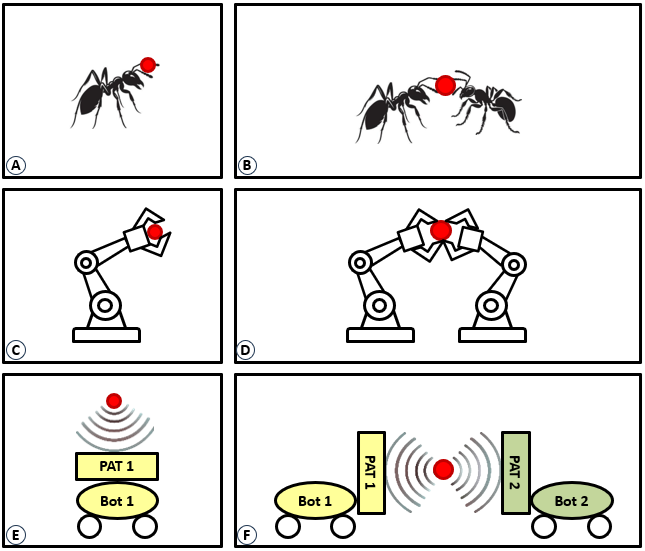

## A Cooperative Contactless Object Transport with Acoustic Robots

Abstract—Cooperative transport, the simultaneous movement of an object by multiple agents, has been widely observed in biological systems such as ant colonies, which improve efficiency and adaptability in dynamic environments. Inspired by these natural phenomena, we present a novel acoustic robotic system for the transport of contactless objects in mid-air. Our system leverages phased ultrasonic transducers and a robotic control system onboard to generate localized acoustic pressure fields, enabling precise manipulation of airborne particles and robots. We categorize contactless object-transport strategies into independent transport (uncoordinated) and forward-facing cooperative transport (coordinated), drawing parallels with biological systems to optimize efficiency and robustness. The proposed system is experimentally validated by evaluating levitation stability using a microphone in the measurement lab, transport efficiency through a phase-space motion capture system, and clock synchronization accuracy via an oscilloscope. The results demonstrate the feasibility of both independent and cooperative airborne object transport. This research contributes to the field of acoustophoretic robotics, with potential applications in contactless material handling, micro-assembly, and biomedical applications.
